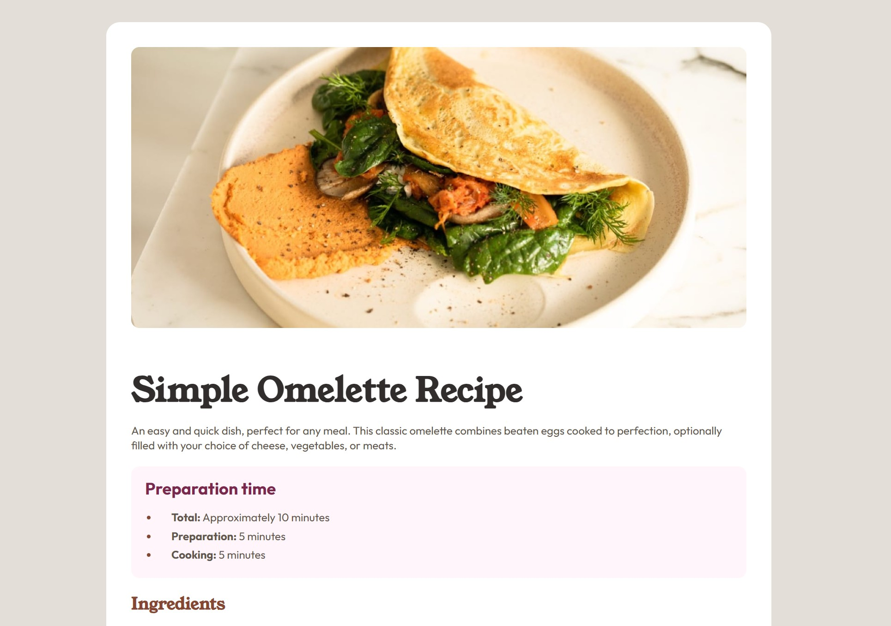

# Frontend Mentor - Recipe page solution



## Table of contents

- [Overview](#overview)
  - [Links](#links)
- [My process](#my-process)
  - [Built with](#built-with)
  - [What I learned](#what-i-learned)
  - [Continued development](#continued-development)
  - [Useful resources](#useful-resources)
- [Author](#author)
- [Acknowledgments](#acknowledgments)

## Overview

This is a solution to the [Recipe page challenge on Frontend Mentor](https://www.frontendmentor.io/challenges/recipe-page-KiTsR8QQKm). The challenge focuses on building a basic webpage with a static, single-page layout. Different style feature-custom color schemes, text fonts, and structural layout rules-applied entirely through CSS. 

### Links

- [Solution URL - GitHub](https://github.com/dulwn/Frontend-mentor-challenge-Recipe-Page)
- [Live site URL](https://dulwn.github.io/Frontend-mentor-challenge-Recipe-Page/)

## My process

### Built with

- Semantic HTML5 markup
- CSS custom properties

### What I learned

I learned how to use CSS custom properties to store my design tokens inside the `:root` selector to ensure maintainability across the stylesheet.

```css
:root {
  /* Design Tokens: Colors */
  --c-Brown-800: hsl(14, 45%, 36%);

  /* Design Tokens: Font styles */
  --ff-sans-serif:'Outfit', Arial, Helvetica, sans-serif;
}
```

I learned how to adapt webpage layouts across different media display sizes by using Media Query range syntax while overriding shared design features with CSS nesting.

```css
p {
    font-size: 16px;
    
    @media (width >= 68.75rem) {
        font-size: 1.15rem;
    }
}
```

I learned how to structure data in an organized layout using semantic HTML `<table>` tag.

```html
<table>
  <tbody>
    <tr>        
      <th></th> <!-- Row Heading --> 
      <td></td> <!-- Row Data -->
    </tr>
  </tbody>
</table>
```

### Continued development

I want to focus on writing more concise and well-structured CSS codes by implementing the Cascade Algorithm and class packaging rules. Fundamentally, I want to establish a logical CSS code structure and flow for better organization, maintainability and readability.

### Useful resources

- [MDN Web Docs](https://developer.mozilla.org/en-US/docs/Web/CSS) - Used to look up unfamiliar css syntaxs and examples.  
- [Google webfonts helper](https://gwfh.mranftl.com/fonts) - Used to download loclized .woff2 font files for self-hosting. This helps to decrease page loading time. 

## Author

- Frontend Mentor - [@dulwn](https://www.frontendmentor.io/profile/dulwn)

## Acknowledgments

- [Coder Coder Builds](https://youtu.be/N-r70Nvo0C0?si=IlBUWHrZs0RYQTcc) - Used as a guide to complete the challenge. 


